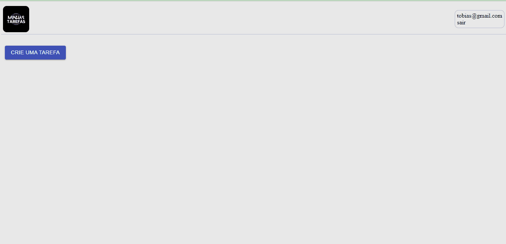

# Task Management
O Task Management é um gerenciador de tarefas, como o próprio nome sugere. Com esse aplicativo, o usuário pode criar tarefas informando o título e a descrição, além de ter a flexibilidade de alterar os detalhes dessas tarefas ou excluí-las. O layout do aplicativo conta com uma boa interativo, proporcionando uma experiência intuitiva para os usuários em ambientes desktop.

## Instalação
1. Clone o repositório: git clone https://github.com/tobiasramos/task-management.git
2. Acesse o diretório do projeto: cd hamburguer-delivery
3. Instale as dependências: npm install

## Uso
1. Execute o projeto localmente: npm start
2. Abra o navegador e acesse: http://localhost:3000

## Tecnologias utilizadas
 - HTML
 - CSS
 - JAVASCRIPT
 - REACTJS
 - MATERIALUI

## Projeto em execução
